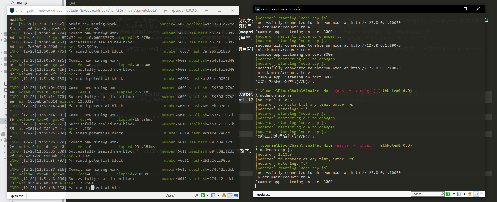
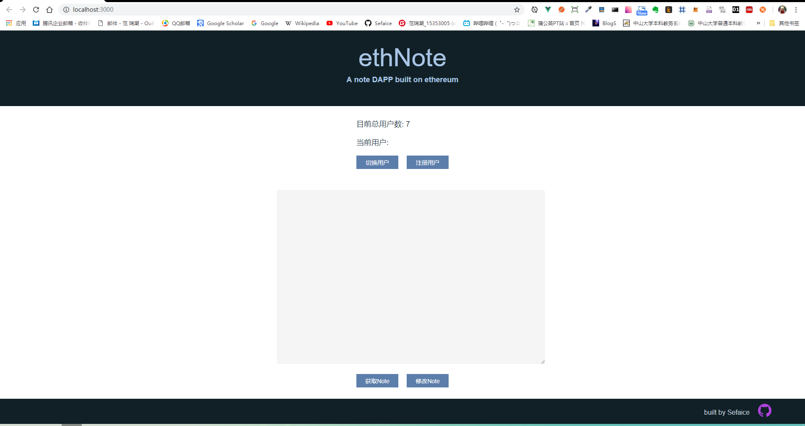
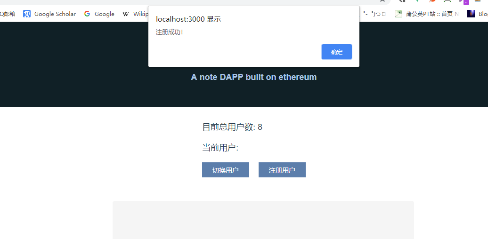
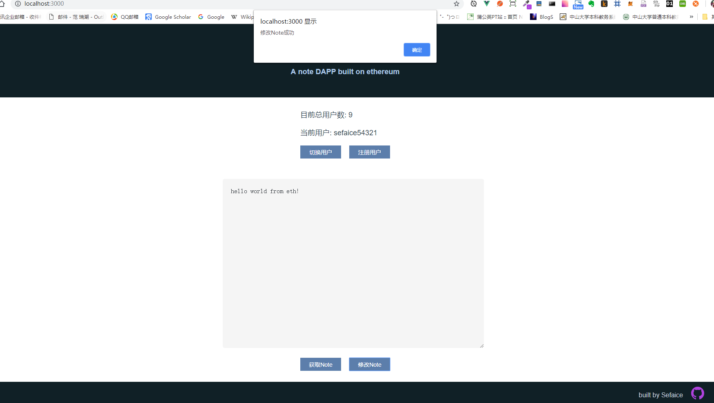
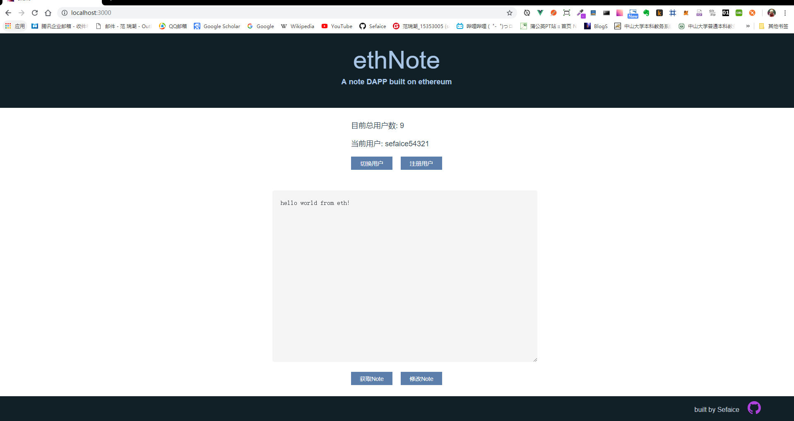

# ethNote

A note DAPP built on ethereum

《区块链原理与技术》期末项目

github地址：https://github.com/Sefaice/ethNote

技术栈：

* 区块链：ethereum私链 + solidity + remix/truffle部署

* 后端：nodejs（express） + web3/truffle-contract调用私链上的合约

* 前端：基于vue框架的SPA

## 运行

* 在一个控制台用geth启动私链：

```
geth --networkid 999 --datadir "E:\Course\BlockChain\Eth-Private\privateData"  --rpc --rpcaddr 0.0.0.0 --rpcport 10070 --rpcapi "personal,db,eth,net,web3,admin,debug,miner,shh,txpool" --port 10071 --rpccorsdomain "*" --nodiscover console
```
```
personal.unlockAccount(eth.accounts[0], "123456")
```
```
miner.start()
```

* 部署合约：已经部署好了，合约的abi和address已经记录，启动私链后可以直接访问。

* 在文件目录下用另一个控制台启动web应用：
```
npm install
```
```
node app.js
```

* 此时访问localhost:3000就可以看到项目页面。

## 选题

开题报告中对选题背景的介绍:

>目前通用的记事本应用都存在着数据安全的问题，用户的隐私是否收到保护，另一方面是本地记事本的数据在设备丢失后会随之丢失。如果使用基于区块链的记事本，数据加密后存放在区块上，隐私安全得到了保障，并且所有终端都访问区块链数据，相当于自带云端存储。

DAPP有着基于区块链的天生优势，所以任何应用放在区块链上都有去中心化的特点。

## 设计与实现

我实现的顺序是从下至上的：合约编写与部署 - 后端构建与调用合约 - 前端搭建

### 合约部分

首先搭建好ethereum私链，开启web3需要的权限。

按照选题的记事应用，我用solidity编写了基本的账户和对应记事内容的数据结构，在把区块链看作一种数据库时可以满足最基本的应用需求。

我选择了truffle框架进行部署的脚手架，可以免除每次部署后都需要复制abi和address的麻烦，编写好truffle1的约束文件就可以直接访问结果，简化debug的流程。

但是我一在本地用web3或truffle部署合约调用时就出问题，web3中不需要transaction的操作都正常，但是有些transaction操作会出问题，而在remix网页上部署合约完全正常。开始我以为是用truffle部署的问题，就改成用remix部署，nodejs调用web3，发现还是不行，最后发现是合约的问题：**不能在一个函数中调用两次数组push，也不能调用两次mapping，也不能在mapping中包含结构体**，最后为了能在node上调用web3合约函数，我把合约改成了**只有一个username的数组，和一个username到单个string的映射作为笔记内容**，把address完全从合约中删掉了，笔记内容也只能一个username一条，一个字符串。

开始的设计本身为了已经是很基本的项目逻辑了，结果node的web3又出现问题，最后的合约只能这样实现了，但是仍然可以满足非常基本的使用，虽然在部署和调试花的时间都够在普通数据库上写一个很大的应用了。

### 后端部分

后端的核心是用web3调用操作部署好的合约，所以我用了nodejs的express框架，因为整个web应用是一个前后端分离的SPA应用，所以后端的主要部分只有数据访问部分，我采用了MVC结构。

应用入口调用controller组件，响应请求的逻辑，再调用utils中的区块链组件进行合约操作，所以后端中访问区块链的部分都在/utils/web3Util.js中，因为区块链访问比较耗时，所以有些函数用callback方式写成了异步方法。

有了web3的util，剩下的就是后端处理路由了，我的API设计如下：
```
Contract Methods: isExistUsername, createUser, getUserCount, setNote, getNote

GET / static RETURN{front-page}

POST /signup {username: string} RETURN{label: bool, msg: string}

POST /signin {username: string} RETURN{label: bool, msg: string}

GET /getNote/{username} RETURN{label: bool, msg: string, note: string}

POST /updateNote/{username} {note: string} RETURN{label: bool, msg: string}

GET /getUserCount RETURN{userCount: int}
```

后端编码完成后，用postman模拟请求测试每个API，都成功实现。

### 前端部分

前端我用vue-cli脚手架搭建了框架，整个部分都在/client下。

vue-cli提供了`npm run serve`把页面运行在本地服务器上，这样在实现过程中就可以访问后端了，并且都有热加载插件，非常方便，出现跨域问题也很简单用插件解决。

前端的UI是手写css，事件用vue的事件绑定，因为是单页应用，所以不需要请求页面，只需要向后端请求数据即可，我用axios实现向服务器的网络请求。

测试没问题后，用`npm run build`即可把前端页面打包，然后放在项目的/public目录下即可。

这样，整个项目就构建和测试完成了。

## 运行结果

在两个控制台分别启动私链和web应用：



运行后打开localhost:3000可以看到主界面：



可以看到当前的用户总数，然后新建一个用户，输入用户名：



注册成功，登录并修改笔记内容：



切换一个账号，若账号不存在会有错误提示，操作笔记时未登录或账户错误也会有提示，然后切换回刚才注册的账号，可以看到刚才提交的笔记内容：



因为访问区块链的交易操作需要一些时间，所以耗时会有些久。
